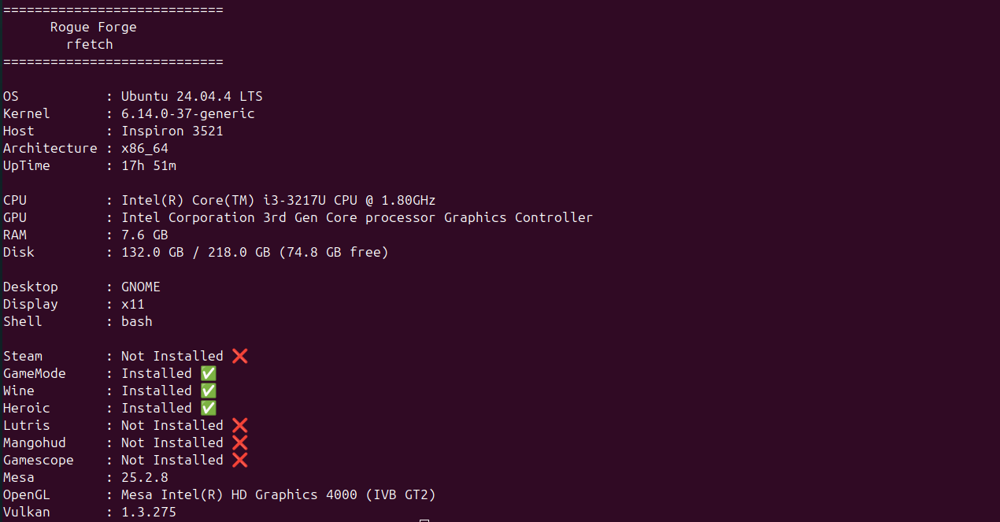

# rfetch

A lightweight and fast Linux gaming system information tool built by **Rogue Forge**.

`rfetch` provides essential system and gaming-related information for Linux users in a clean terminal interface.

## Features

### System
- Linux distribution
- Kernel version
- Host name
- Architecture
- System uptime

### Hardware
- CPU information
- GPU information
- RAM size
- Disk usage

### Desktop
- Desktop environment
- Display server
- Shell

### Gaming
- Steam detection
- GameMode detection
- Wine detection
- Heroic Games Launcher detection
- Lutris detection
- MangoHud detection
- Gamescope detection
- Mesa version
- OpenGL renderer
- Vulkan version

## Preview



## Installation

Clone the repository:

```bash
git clone https://github.com/RogueForge/rfetch.git
cd rfetch
```

Run:

```bash
python3 main.py
```

## Example Output

```text
============================
      Rogue Forge
        rfetch
============================

OS           : Ubuntu 24.04.4 LTS
Kernel       : 6.14.0-37-generic
Host         : Inspiron 3521
Architecture : x86_64
UpTime       : 5h 39m

CPU          : Intel(R) Core(TM) i3-3217U CPU @ 1.80GHz
GPU          : Intel HD Graphics 4000
RAM          : 7.6 GB
Disk         : 132.0 GB / 218.0 GB

Desktop      : GNOME
Display      : x11
Shell        : bash

Steam        : Not Installed ❌
GameMode     : Installed ✅
Wine         : Installed ✅
Heroic       : Installed ✅
Lutris       : Not Installed ❌
Mangohud     : Not Installed ❌
Gamescope    : Not Installed ❌

Mesa         : 25.2.8
OpenGL       : Mesa Intel(R) HD Graphics 4000 (IVB GT2)
Vulkan       : 1.3.275
```

## Requirements

- Python 3.10+
- Linux

Some features also require the following system tools:

- `glxinfo` (Mesa/OpenGL information)
- `vulkaninfo` (Vulkan information)
- `lspci` (GPU detection)

## Roadmap

### v0.2
- [ ] Configuration file
- [ ] Color themes
- [ ] Battery information
- [ ] Package manager detection
- [ ] JSON output
- [ ] Better multi-GPU support

### Future

- More Linux gaming integrations
- More hardware information
- Performance-focused features
- Additional desktop environment support

## License

This project is licensed under the MIT License.

---

Developed with ❤️ by **Rogue Forge**.
